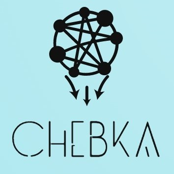

## Chebka
> A content aggregator :postbox:

---
<!-- PROJECT LOGO -->
<p align
 <a href="https://github.com/threadsv1/Chebka/tree/django-cache">
    
    </a>

#### introduction:
    >>> in the age of information you have to equip yourself with a content aggregator that keeps you on top of your game
        so we decided to try to make a little tool that will ease  access to content from various sources
### Team:
#### Team members:
Saif Gaida
Majd Mednini
Cohort #16
#### Roles:
##### Back-end:
 Saif is responsible for Integration of user-facing elements developed by front-end developer with server side logic, and trying to introduce security methods
 
<a href="https://github.com/threadsv1/Chebka/tree/django-cache">
 
</a>

#### CLI Installation
```shell 
$ git clone  https://github.com/threadsv1/Chebka/tree/django-cache
$ cd  Chebka
$ pip install -r requirements.txt
$ python manage.py makemigrations
$ python manage.py migrate
```

#### Usage:
currently the site is not hosted online so to run an instance of it locally run:
```shell 
$python3 runserver
```
**currently conencts on port 8000 so make sure nothing is running on it**

# ✍️ Contributing
Interested in contributing to the Well app project? Thanks so much for your interest! We are always looking for improvements to the project and contributions from open-source developers are greatly appreciated.

If you have a contribution in mind, please contact one oft the authors of the repo

#### Technologies:

[requiremetns.txt](https://github.com/threadsv1/Chebka/blob/main/requirements.txt)
Resources: Geeksforgeeks - w3schools - djangoproject - developer mozilla - realpython - cpske github
IDE: Visual Studio Code
Alternatives: Django can be substituted with flask library,  newsapi with newspaper

#### Challenge:
“Chebka” will try to bring the most relevant, hottest content  in a single web page, easy to navigate, energy and attention saving, because there is just “Too Much choice” ; however due to overwhelming  amounts of content we have to acknowledge that without a machine learning model imbricated within the django framework  Personalization levels will be a little off-putting, so Chebka will not tackle the personalization  the targeted users are primarily software developers who want to be served the latest news and tutorials pertaining to their stacks
For now the only impediment for chebka is the language boundary  

had to choose some specific sources to  showcase because we got ip banne dand got errors from some websites
and to avoid changing between proxies in the mvp
check this blog to learn h

#### Risks:
An apparent technical risk is traffic congestion, so a strict bandwidth limit is to be set, and the algorithm can only handle so many  resources, so a rotation has to be made primarily
A non technical risk is a a somewhat of a moral hazard towards publishers where they might not grant us rights to publish their content for profit in a later stage
Spreading poor content is another problem but measures can be taken to prevent that


#### Related Projects:
[newspaper : Newspaper3k Article scraping & curation](https://github.com/mattlisiv/newsapi-python) :newspaper:
[newsapi](https://github.com/mattlisiv/newsapi-python) :clipboard:


#### Existing Solutions:
Similar solutions:
Flipboard : gathers news from known and trusted sites and has broad categories of content we intend to include a broad range of topics for every user also and with a better graphic interface
alltop:  ui design is uninspiring and off putting so we try  to keep away from that
news google: great overall on web and especially mobile

#### Licensing:
[](https://opensource.org/licenses/MIT)
